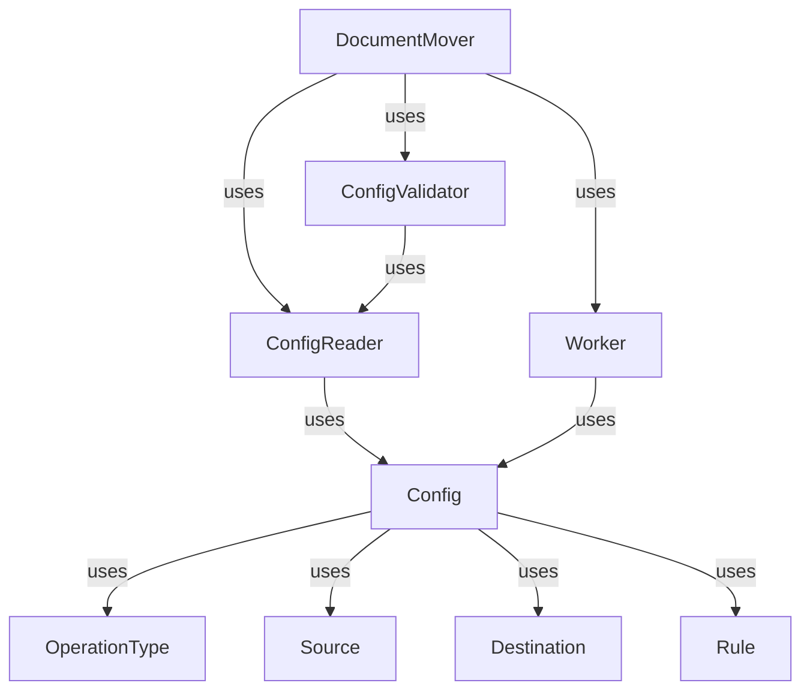

# Classes

```mermaid
graph TD;
  DocumentMover -->|uses| ConfigValidator;
  DocumentMover -->|uses| ConfigReader;
  DocumentMover -->|uses| Worker;
  ConfigValidator -->|uses| ConfigReader;
  ConfigReader -->|uses| Config;
  Worker -->|uses| Config;
  Config -->|uses| OperationType;
  Config -->|uses| Source;
  Config -->|uses| Destination;
  Config -->|uses| Rule;
```
